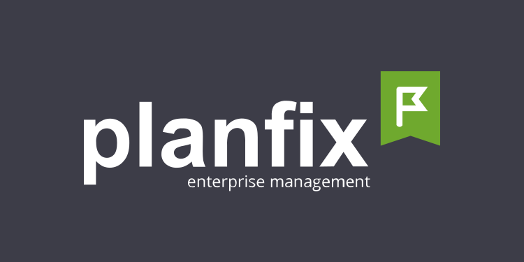

#  go-planfix


**go-planfix** is a Rest API for [Planfix.com](http://planfix.com). You can manage
your application with this library. It contains multiple
API requests Planfix provides with support of CRUD operations.

## Quick Start / Installation

To get started with **go-planfix**, you'll need to do the following:

- Install the latest version of Go.
- Install the **go-planfix** package using go get.
- Use the **go-planfix** package in your Go code.
- Here's an example of how to install the package:

```
go get github.com/whatcrm/go-planfix
```

## Models

**go-planfix** includes a package for working with models, which allows you to use just the API and **create your own models**.
This means you can create your own structs and use them with our **go-planfix** package,
even if you don't want to use every field from Planfix's entities.

Here's the link to [Models](https://github.com/whatcrm/go-planfix/models) package and example of how to install the package.

```
go get github.com/whatcrm/go-planfix/models
```

## Features

- *Lightweight and easy-to-use*
- Simple and efficient net/http solution
- Comprehensive **CRUD** for working with Planfix

## Ecosystem / Documentations

- [planfix documentation](https://planfix.com/help/REST_API)
- [net/http client](https://pkg.go.dev/net/http)


## Contributors

> **go-planfix** is maintained by [WhatCRM Organization](https://github.com/whatcrm).
> If you'd like to contribute to the project, please reach out to us via [Issues](https://github.com/whatcrm/go-planfix/issues).
